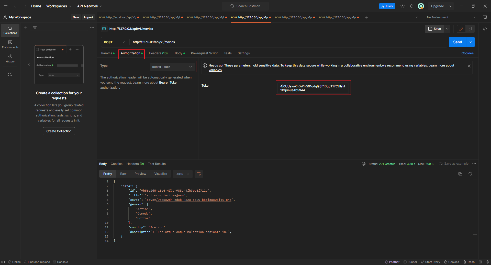

## Local dev env (via `laravel/sail` and `docker`):

follow these steps to prepare the local dev env (based on `laravel/sail` and `docker`):

1. run `composer update`

2. run `composer install`

3. run `cp .env.example .env`

4. run `php artisan key:generate --ansi`

5. open `.env` file and fill `DB_PASSWORD` field

6. run either `npm run dev_windows_start` or `npm run dev_linux_start`\
    (this will start the app via `laravel/sail` and `docker`)

7. run either `npm run __dev_windows_sail_artisan_migrate` or `npm run __dev_linux_sail_artisan_migrate`\
    (this will migrate the database)

8. run either `npm run __dev_windows_sail_artisan_db_seed` or `npm run __dev_linux_sail_artisan_db_seed`\
    (this will seed the database)

9. open http://localhost/api/v1/register (or `/login` & `/logout` on subsequent visits) in the `postman` to create a new user and generate access token.

10. to auth your request in `postman` use:

----

## Features:

### Required:

- 1a) CRUD of movies (`http://localhost/api/v1/movies` supports `GET`, `POST`, `PUT`, `PATCH`, `DELETE` requests).

- 1b) Movies' `POST`, `PUT`, `PATCH` requests require a filed `cover` which is an image file.

- 2a) Movies can have more than 1 genre (`many-to-many` relation between `genres` and `movies` tables).

- 2b) Movies can be searched by title (syntax `http://localhost/api/v1/movies?title[eq]=quo%20vadis`).

- ~~3a) User can like movies~~\
    (can be implemented as `many-to-many` relation between `users` and `movies` tables).

- 3b) Movie covers are automatically resized to a specified width and height.

### Extra:

- local dev env is based on `docker` -> app can be rewritten as `microservice` (via proper `Dockerfile` and `docker-composer.yml` configuration).

- rest api is versioned (to let people opt-in when they are ready instead of forcing the update onto them).

- rest api requires authentication via `laravel/sanctum` (http://localhost/api/v1/register, http://localhost/api/v1/login and http://localhost/api/v1/logout).

----

## TODO:

1. TESTS !!! write tests for every `migration`, `seeder`, `factory`, `model`, `controller`, `resource`, `route`, ...

2. recreate this app as a `microservice` (via proper `Dockerfile` and `docker-composer.yml` configuration).

3. The `user` system:
    - user roles like `Admin`, `Publisher`, `Basic`, ... (many-to-many relation).
    - ability for a user to like a movie.

----

## WARNING:

There is a well known error with postman that prevents people from using `PUT` and `PATCH` requests with `form-data` (which is necessary if we want to upload a image).

Please see https://stackoverflow.com/q/14494747/5098833 for more information.

### Quick `PUT` work around:

### Quick `PATCH` work around:

